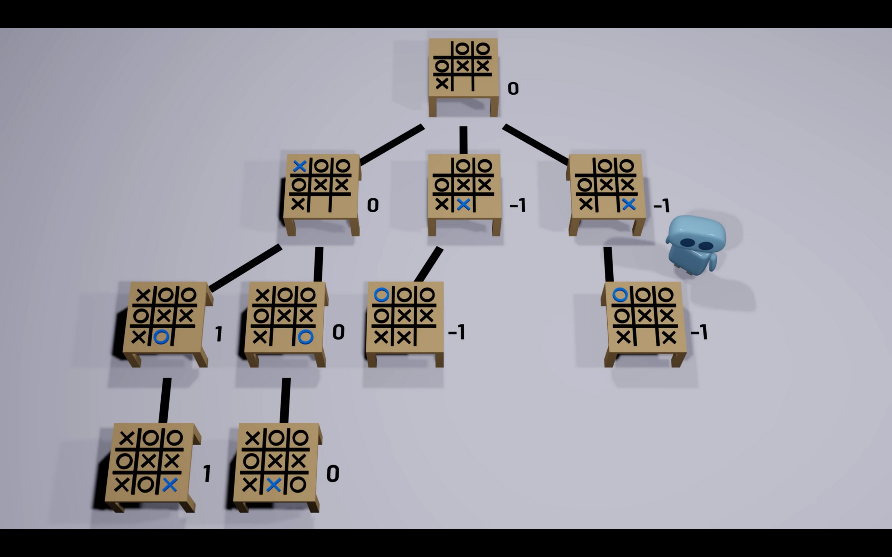
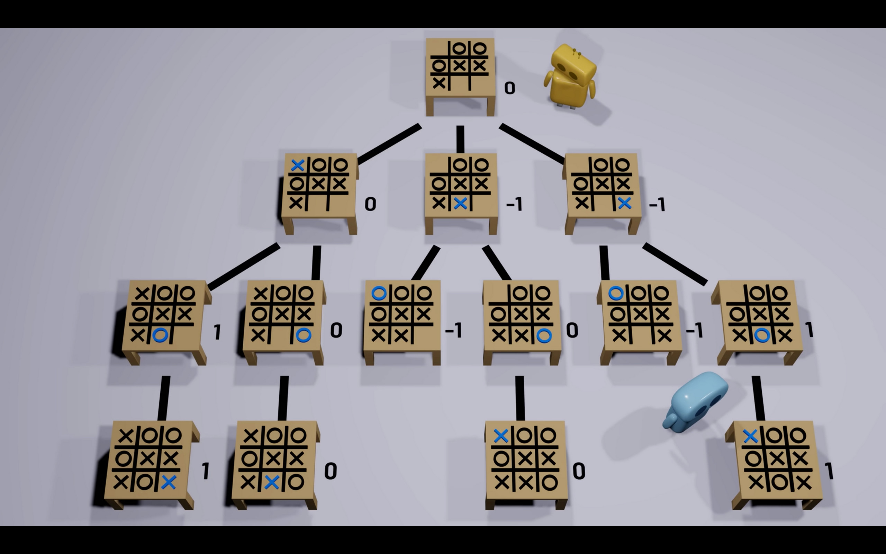

# Minimax

Minimax works by creating a decision tree that will simulate every possible moves that the 2 players can make.

Each level of the tree will be a different player's turn. For example in the above tree, the first level will be the initial game state to simulate and the turn will be X's turn. The second level will have nodes that contain the moves that X can make and the turn will be O's turn. The third level will have nodes that contain the moves that O can make in reponse to the previous X's move and the turn will be X's turn, and so forth. 

Leaf nodes will receive a heuristic evaluation, the heuristic evaluation will take into account the piece count, king count, piece positioning, mobility, king safety and control of the center of the board. 

The parent nodes will take the highest or lowest evaluation score of their child nodes (depending on whose turn it is)

In this case, X is the maximizing player, so they will try to pick the highest evaluation, and O is the minimizing player, so they will try to pick the lowest evaluation. 

The minimax algorithm will utilize depth first search to traverse the tree and give a score to each of the nodes.

Let's examine the 2nd level: In this level, the nodes contain all the moves X can make and it is O's turn to move. Since it is O's turn to move, the nodes in this level will try to pick the lowest evaluation in the child nodes, because O is trying to minimize the score. 

Then, at the 1st level, which is X's turn, the root node will try to pick the highest evaluation because X is trying to maximize the score. 

# Alpha-Beta pruning

Consider a different example, in this tree, we can see that the 0 left child branch of the middle branch in the 2nd level has an evaluation of 0, we know that in the 2nd level, it is O's turn, and O is trying to minimize the score, so it will always pick the -1. So from here on out, for this particular branch, O will always have an evaluation of -1 or lower. 

Since we already found a better option for X in the left most branch on the 2nd level, we can stop searching the middle branch because we know that even if the evaluation is better, O will nevel choose it. Therefore we can prune the 0 branch of the middle branch on the 2nd level. 

The same principle can be applied to the right branch on the 2nd level. 

This will drastically improve the performance. 

The time complexity for minimax is $O(b^m)$ where b is the average number of child nodes of a parent node, and m is the depth of the tree. 

With Alpha-Beta, the time complexity will be $O(\sqrt{b^m})$. In the worst case scenario, Alpha-Beta won't be able to prune any branch, so the time complexity will still be $O(b^m)$. But best case scenario, it will prune a lot of branches and improve the performance drastically
